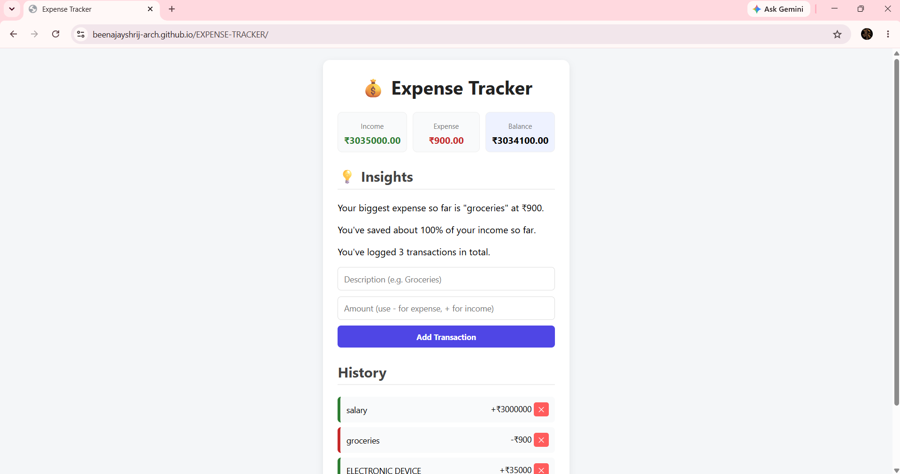

# 💰 Expense Tracker

A simple, beginner-friendly expense tracker built with vanilla JavaScript. Track income and expenses, see your balance update live, and get automatic spending insights — all data saved locally in your browser.

🔗 **Live Demo:** https://beenajayshrij-arch.github.io/EXPENSE-TRACKER/

## Features

- Add income and expense transactions
- Live balance, income, and expense summary
- Color-coded transaction history (green = income, red = expense)
- Delete individual transactions or clear all
- **Smart Insights** — automatically analyzes your spending and shows summary sentences (e.g. biggest expense, savings rate)
- Data persists using browser localStorage — no backend or database needed

## Tech Stack

- HTML5
- CSS3
- Vanilla JavaScript (ES6)
- Browser localStorage API

## How to Run Locally

1. Clone this repo or download the ZIP
2. Open `index.html` in any browser — no installation or build steps required

## Screenshots

   
   